# Git e GitHub na dio

## Sistemas de controle de versão

- Controla as versões de um arquivo ao longo do tempo
- Registra o histórico de atualizações de um arquivo
- Gerencia quais foram as alterações, a data, autor, etc
- Organização, controle e segurança

## Tipos de Sistemas de controle de versão

- VCS Centralizado (CVCS) > ex: CVS, Subversion
- VCS Centralizado as versões ficam em um servidor centralizado, caso aconteça algum problema com o servidor ficamos sem poder contribuir até o servidor voltar.
- VCS Distribuído (DVCS) > ex: Git, Mercurial
- VCS Distribuído surgiu em busca de resolver problemas dos CVCS
- Clona o repositório completo, o que inclui o histórico de versões
- Cada clone é como um backup
- Possibilita um fluxo de trabalho flexível
- Possibilidade de trabalhar sem conexão à rede

## Git

- DVCS > Sistema de controle de versão distribuído
- Gratuito e Open Source
- Ramificações (branching) e fusões (merging) eficientes
- Leve e rápido
- https://git-scm.com/ about e documentation

## Fluxo básico no git

- git clone > clona um repositório git existente para um novo diretório(pasta)local
- git commit > grava alterações no repositório
- git pull > puxa as alterações do repositório remoto para o local(busca e mescla)
- git push > empurra as alterações do repositório local para o remoto

## GitHub

- Plataforma de hospedagem de código para controle de versão com Git, e colaboração
- Comunidade ativa
- Utilizado mundialmente
- Git !== GitHub

## Gitbash

- git config --global user.name "lemos"
- git config --global user.email "lemos@email.com"
- git config user.name
- git config user.email
- git config init.defaultBranch // master
- git config --global init.defaultBranch main
- git config init.defaultBranch // main
- git config --global --list // retorna configurações do global user, email, editor e outras
- git config credential.helper cache // temporario > mais de uma pessoa
- git config credential.helper store // permanente > uso pessoal

## Primeiros passos git e github criando e clonando repositórios

- Existem duas formas de obter um repositório git na máquina local
- Transformar um diretório local que não está sob controle de versão, num repositório Git com git init

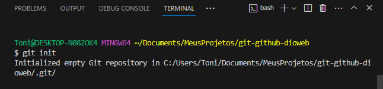

- Utilizando cd .git para acessar na pasta o caminho .git que é oculto, esse arquivo é responsavel por gerenciar nosso controle de versão

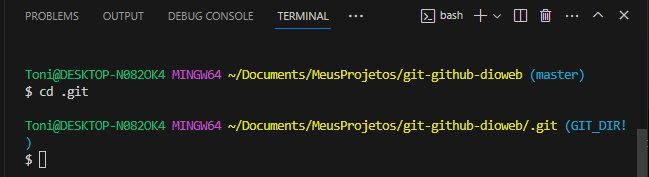

- Utilizando o ls para ver os arquivos em .git

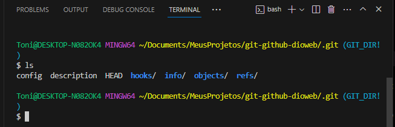

- Clonando um repositório Git existente com git clone

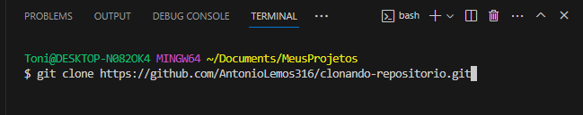

- Verificando com o ls a pasta que foi clonada

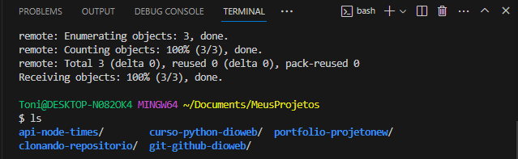

- Podemos clonar o repositório com outro nome

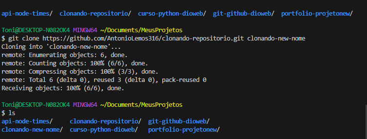

- Criando um repositório local e adicionando o git init e observando com cat config que ele não está associado a nenhum repositório online

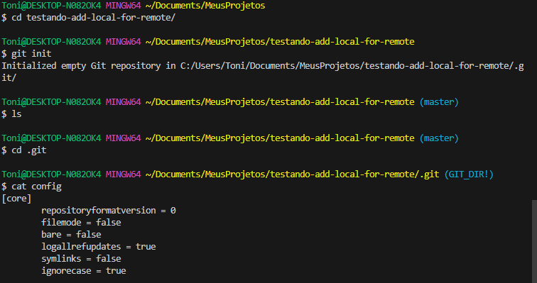

- Após utilizar o comando git remote add origin com a url do repositório online que queremos associar no repositório local, conseguimos ver que ele foi associado atraves de cat config

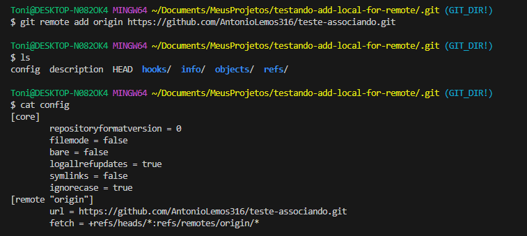

## Salvando alterações locais

- Breve resumo do que foi estudo até agora

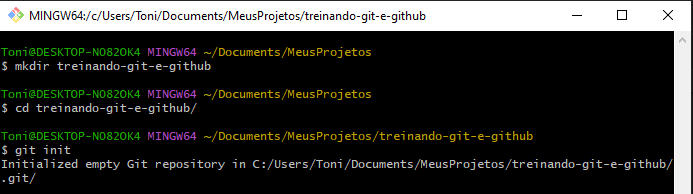

- Com o git status observamos como esta o estado atual do repositório

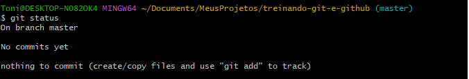

- Com o touch README.md criamos um arquivo na pasta e ao rodar o git status novamente ele mostra o estado atual e a alteração que foi feita e também mostra um sugestão do que pode ser feito

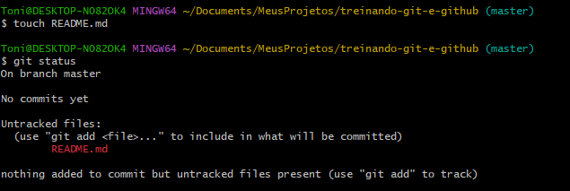

- Com o git add e o nome do arquivo especificamos qual arquivo vamos colocar na staging area para ser incluído no próximo commit

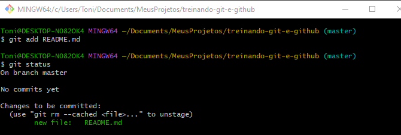

- Com o git commit -m"mensagem" criamos um novo commit no repositório git com uma mensagem associada ao commit

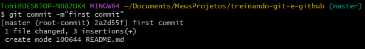

- Com o git log podemos ver os históricos de commit em um repositório git

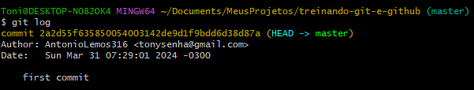

- Com o git status observamos que não à nenhuma alteração a ser feita

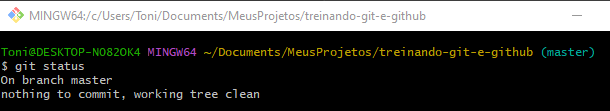

- Ao utilizar o mkdir e criar uma pasta vazia e rodar o git status ele não reconhece a pasta vazia como uma alteração

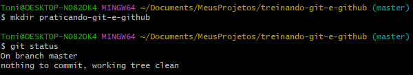

- Ao utilizar o touch indicando a pasta criada anteriormente, criaremos um arquivo nela, em seguida rodaremos o git status e agora ele consegue ver a pasta

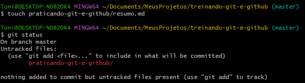

- Com o comando echo o caminho da pasta > .gitignore estamos criando um arquivo .gitignore que dentro dele tera escrito o caminho da pasta

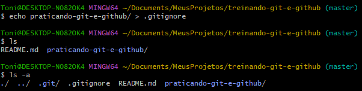

- Com o git status podemos ver que o arquivo .gitignore foi listado com untracked e a pasta praticando-git-e-github foi ignorada

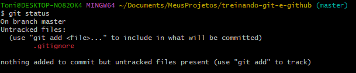

- Ao utilizar echo > .gitignore, criamos um novo arquivo .gitignore vazio, ao roda o git status ele volta a ver a pasta que antes estava ignorada

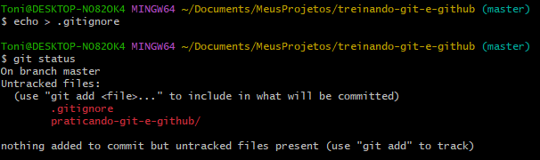

- Geralmente ao criar uma nova pasta existe uma convenção que é criar dentro dela um arquivo chamado .gitkeep para a pasta não ficar vazia

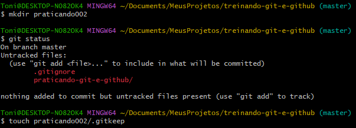

- Com o git status e utilizando a convenção a pasta sera reconhecida mesmo estando "vazia"

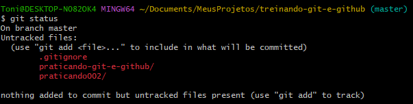

- Com o git add . estamos indicando que vamos adicionar todos os arquivos para a area de staging

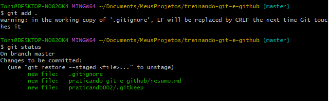

- Utilizando o git commit -m"mensagem" fizemos o nosso commit para o repositório do git

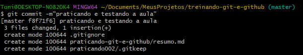

- Com o git log observamos nosso histórico de commits

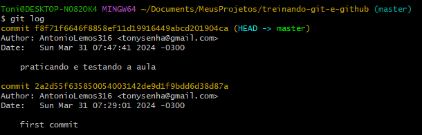

## Desfazendo alterações no repositório local

- Utilizando o rm -rf .git para remover a força o diretório git

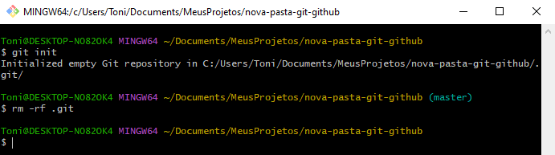

- Com o git status vemos que o repositório não é mais um repositório git

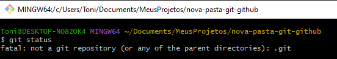

- Com o git restore e indicando o nome do arquivo, conseguimos voltar ao último estado do commit caso tenha feito alguma alteração, como apagar o conteúdo do arquivo. Obs: tomar cuidado ao utilizar esse comando

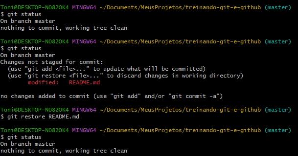

- Com o git commit --amend -m "mens" alteramos a mensagem do nosso ultimo commit

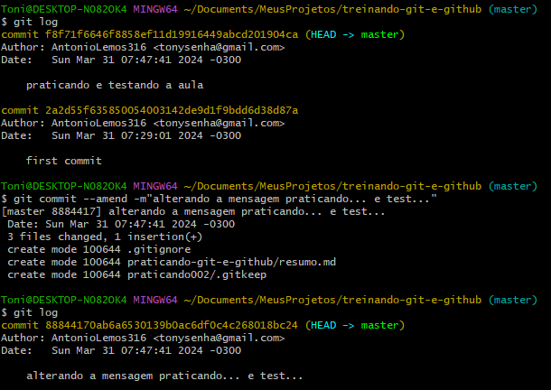

- Com o git reset --soft e o hash do commit, nós voltamos o commit anterior para a area de staging novamente

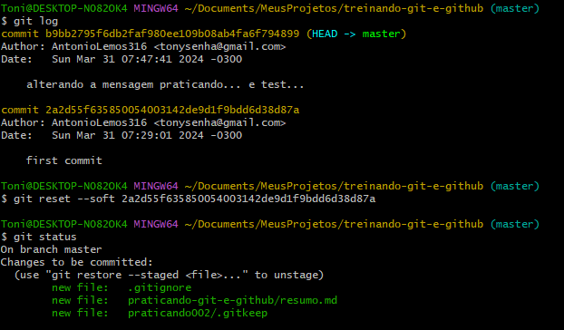

- Com o git reset --mixed e o hash do commit, voltamos a area de trabalho antes da area de staging

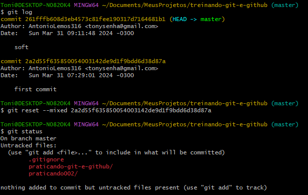

- Com o git reset --hard e o hash do commit, apagamos tudo e voltamos até o ultimo commit. Obs: muito cuidado ao usar esse comando

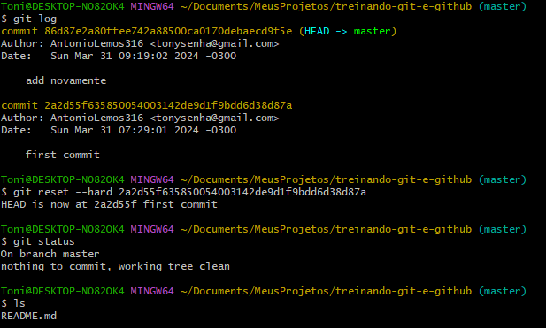

- Utilizando o git reflog para ter um histórico mais detalhado do repositório local e todas essas alterações deve ser feitas antes de serem enviadas ao repositório remoto

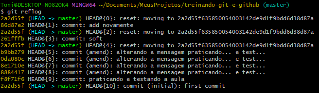

## Enviando e baixando alterações com o repositório remoto

- Pegando as alterações locais e colocando no repositório remoto

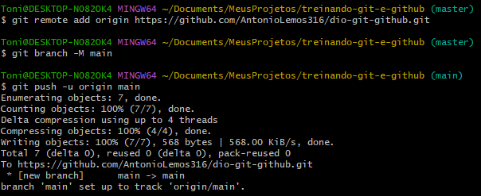

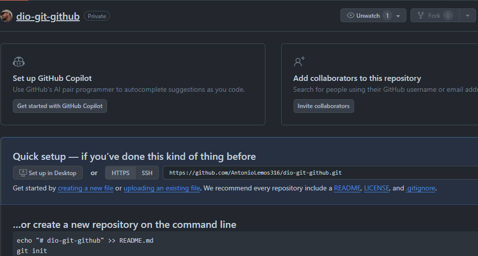

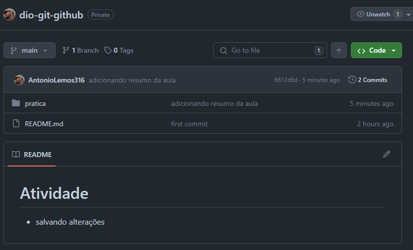
